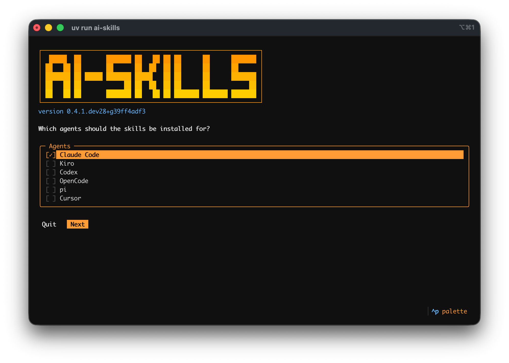

# `ai-skills`

Reusable skills for AI coding agents. They give an agent your project's patterns, constraints, and
conventions, so its output is consistent from one run to the next.

Each skill is a self-contained directory holding a `SKILL.md` and the reference material it needs,
following the [Agent Skills](https://agentskills.io) format, so any coding agent that loads skills
can use them. Skills are grouped by domain. Domains are independent, so you can install one skill
without the others.

| Domain | Purpose | # Skills |
|---|---|---|
| [**adr**](./skills/adr/) | a project's architecture decision log | 1 |
| [**agents**](./skills/agents/) | the files a coding agent reads: agent-context files and new skills | 3 |
| [**dev**](./skills/dev/) | recording how a repository is developed, filing issues, carrying a spec or issue to a merge-ready pull or merge request, and the forge's issue, request, and review templates | 4 |
| [**human-docs**](./skills/human-docs/) | prose documents written for people, and their export to PDF, Word, and Excel | 5 |
| [**release**](./skills/release/) | versioning and release notes derived from Conventional Commits, and an optional public publish path | 1 |
| [**research**](./skills/research/) | the spec-driven development loop: a working folder, research, a plan, implementation, and retirement | 5 |
| [**software-docs**](./skills/software-docs/) | a project's documentation tree and the site that builds it | 2 |

## Install

### Manual

Each skill is one directory under `skills/<domain>/` in this repository, holding a `SKILL.md` and
usually a `references/` folder. Copy the whole skill directory, `references/` included, into the
skills directory your agent reads. Use the project-level directory to install for one project, or
the user-level directory to make the skill available in every project. For Claude Code those are
`.claude/skills/` and `~/.claude/skills/`:

```sh
cp -R skills/research/ai-plan ~/.claude/skills/
```

For any other agent, see its documentation for where its skills directory is.

### Installer

The installer copies the skills you choose into the skills directory of each agent you choose:
Claude Code, Kiro, Codex, OpenCode, pi, or Cursor. It runs with [`uv`](https://docs.astral.sh/uv/),
and shows every file it will write before it writes anything.

```sh
uvx --from git+https://github.com/aws-samples/sample-ai-skills@vX.Y.Z ai-skills
```



[Install Skills with the Installer](how-to/install-skills-with-the-installer.md) walks
through every screen, the flags for a non-interactive install, and what each agent receives.

## Where to go next

The documentation is organized on two axes. [**Skills**](./skills/) is the product axis — one page
per skill, grouped by domain. The remaining [Diátaxis](https://diataxis.fr) sections hold what no
single skill owns:

- [**Skills**](./skills/) — what each skill is, how it is invoked, what it declares
- [**How-to**](./how-to/) — you bring the goal, the guide gives the shortest route
- [**Explanation**](./explanation/) — the reasoning behind a convention
