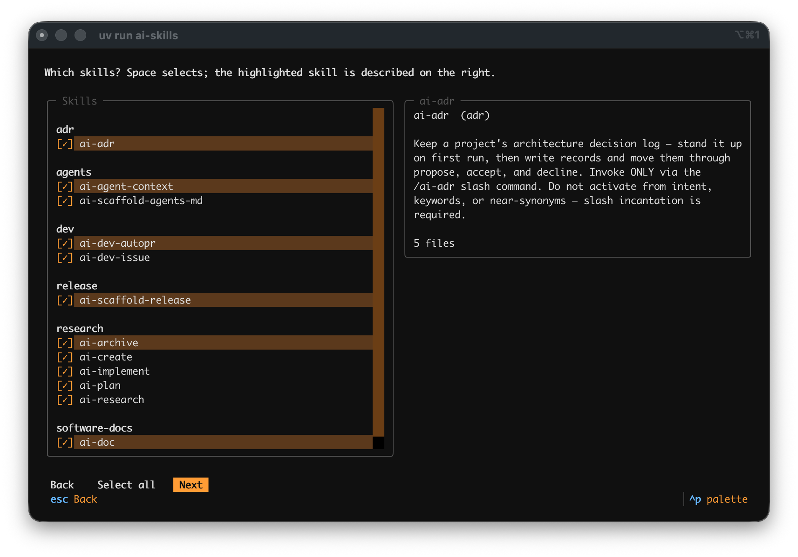
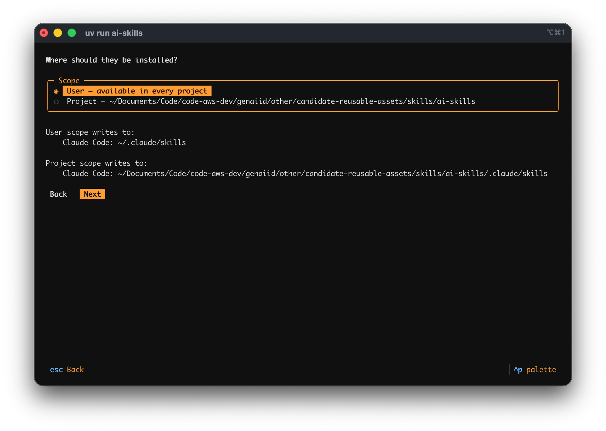
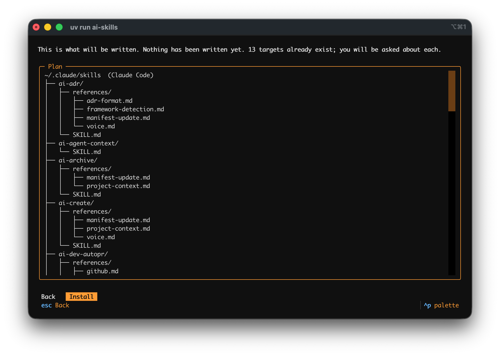
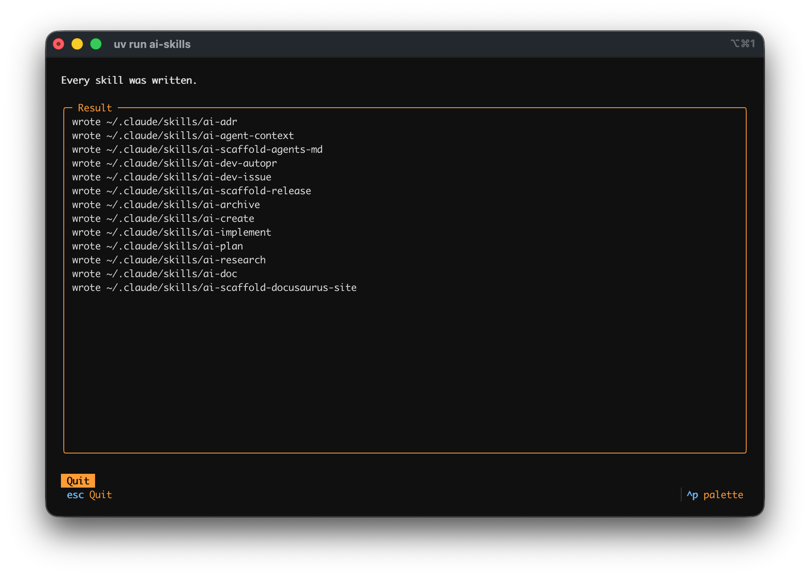

# Install skills with the installer

The installer copies skills from this repository into the skills directory of each coding agent
you choose. It shows every file it will write before it writes anything, and it never replaces an
existing skill directory without asking.

## Before you start

Install [`uv`](https://docs.astral.sh/uv/), Astral's Python package and project manager. The
installer does not install it. `uv` fetches the Python the installer needs.

## 1. Start the installer

Run it from a release tag, replacing `vX.Y.Z` with the tag you want:

```sh
uvx --from git+https://github.com/aws-samples/sample-ai-skills@vX.Y.Z ai-skills
```

From a clone of this repository, `uv run ai-skills` runs the same installer against the clone's
`skills/`.

## 2. Choose the agents

Select every agent the skills should be installed for: Claude Code, Kiro, Codex, OpenCode, pi, or
Cursor. Space toggles the highlighted agent. Select **Next**.


## 3. Choose the skills

Skills are listed under their domain. Space toggles the highlighted skill, and the panel on the
right describes it and counts its files. **Select all** selects every skill. Select **Next**.



## 4. Choose the scope

**User** installs into your user-level skills directory, so the skills are available in every
project. **Project** installs into the current directory. The screen lists the directory each
chosen agent will receive under each scope. Select **Next**.



## 5. Review the plan

The plan lists every directory and file the installer will write. Nothing has been written yet.
When a target already exists, the screen says how many, and the installer asks about each one
before replacing it. Select **Install**, or **Back** to change a choice.



## 6. Read the result

The result screen lists each skill directory written. Select **Quit**.



## Install without the interactive screens

Every choice is also a flag:

```sh
uvx --from git+https://github.com/aws-samples/sample-ai-skills@vX.Y.Z ai-skills \
  --agent claude-code --skill ai-plan --scope project --yes
```

`ai-skills --help` lists the flags. `ai-skills list` shows what the installer recorded, and
`ai-skills uninstall` removes it.

## What each agent receives

Claude Code receives each `SKILL.md` unchanged. Every other agent receives a copy without the
frontmatter fields it does not read, and with the skill's tool restrictions written into the body.
That agent follows those restrictions but does not enforce them, and the installer warns about each
one.
